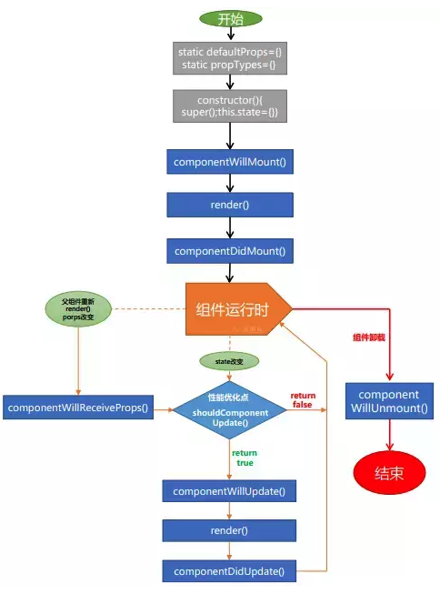
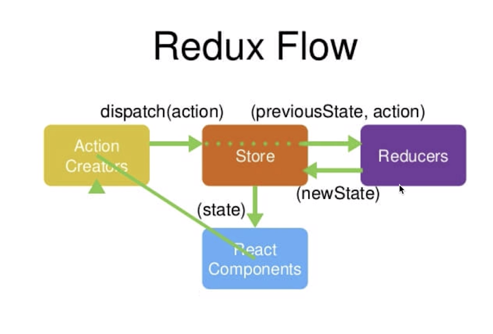
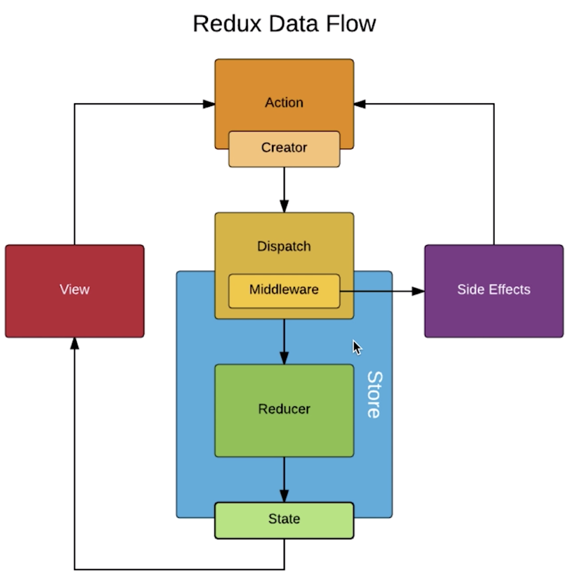

This project was bootstrapped with [Create React App](https://github.com/facebook/create-react-app) for learn react.

## Available Scripts

In the project directory, you can run:

### `npm start`

Runs the app in the development mode.<br>
Open [http://localhost:3000](http://localhost:3000) to view it in the browser.

### `npm test`

启动 jest 测试程序

### `npm run eject`

将项目的隐藏配置文件打开，此过程不可逆

## Learn React

React 和 Vue 类似，主要从React React-router Redux 三个模块学习

### React

#### jsx语法
1. {} 写代码块
2. <></> 写html
3. class —> clssName
4. style={{}} 里面是对象
5. browserjs   将jsx解析为js
6. React.createClass()   React.Component 创建组件
7. ReactDOM.render()   渲染到html页面
   
#### React生命周期

1. getInitialState  初始化组件state(es5 es6 写法)
2. componentWillMount  在组件加载完成前立即执行，还不能访问真实dom
3. componentDidMount  挂载后立即调用，DOM node初始化放这 异步请求统一放这
4. componentWillReceiveProps()  此事件的参数是指要更新的props
5. shouldComponentUpdate(object nextProps, object nextState)  控制react更新频率. 用来提升组件效率。
   ```
   {
       if(nextProps.content !== this.props.content) {
            return true
        } else {
            return false
        }
    } // 没有改变的时候不需要进行diff 比对
   ```
6. componentWillUpdate  在更新前被立即调用，不能在此调this.setState()  react底层已经做完state对比
7. componentDidUpdate  在更新发生后立即调用。这是一个react组件更新完成后的通知
8. componentWillUnmount   在组件被卸载和摧毁前被立即调用。清理应该放这里 

   

#### 组件通信
1. react 父子组件通信都是单向数据流
2. props 都是由父元素所传进来，不能更改，若要更改 props 则必须由父元素进行更改
3. 当 React 发现 props 或是 state 更新时，就会重绘整个 UI
4. 父组件往子组件传递数据：通过属性的方式，子组件通过this.props获取 (单向数据流 子组件不能更改传过来的值)
5. 子组件往父组件传递数据：通过父组件向子组件传递事件，子组件触发事件回调给到父组件
   
#### 虚拟DOM
正常流程
1. state 数据
2. JSX 模板
3. 数据 + 模板 结合，生成真实的DOM，来显示（生成虚拟DOM — JS对象，用来描述真实DOM）
4. state 发生改变
5. 数据 + 模板 结合，生成真实的DOM, 替换原始的DOM
   
缺陷
1. 第一次生成了一个完整的DOM片段
2. 第二次生成一个完整DOM片段 （耗性能，浪费，diff优化）

优化

6. 新的DOM 和 老DOM做比对，找差异
7. 只更新有差异的DOM

整个过程
> JSX —> React.createElement(‘div’, {}, ‘item’) —> 虚拟DOM —> 真实DOM

优点
1. 性能提升
2. 跨端可以实现  react-native\

#### setState方法
1. diff 比对发生在这个时候  同层比对  key 可以提升虚拟DOM比对 效率  删除 dom后 index 会变化  能不用index做key值就不用index
2. 在 合成事件 和 生命周期钩子(除 componentDidUpdate) 中，setState是"异步”的 （判断是在事务流执行中，推入队列）
3. 在 原生事件 和 setTimeout 中，setState是同步的，可以马上获取更新后的值。
   

### React-Fiber(纤维)

将底层调度算法 由
<b>同步递归</b>  (不能暂停和恢复)
改为 <b>单链表树遍历</b>  可以通过任务分割，提升性能

### React-Router
1. 页面路由
   ```
    window.location.href = ‘www.baidu.com’
    history.back()
   ```
2. Hash Router
   ```
    Window.location = ‘#hash’
    Window.onhashchange = function() {
        console.log(‘current hash:’, window.location.hash)
    }
   ```
3. H5 Router  (既能操作hash 也能操作 路径   兼容比hash 差一点)
   ```
    history.pushState('test','Title', '#name’)
    history.pushState('test','Title', '/name’)   // 推进一个路由
    window.onpopstate = function(e) {console.log('H5 ROUTER BACK',  e.state)}  // 后退时候执行
    history.replaceState('test','Title', '/go’) // 替换当前路由
   ```
4. this.props.match.params.id  获取路由参数


### Redux
Redux = reducer + flux



1. 只有store 才能改变store  不要在reducer里改变 store 返回 newStore
2. Reducer 一定是个纯函数（给定固定的数，返回固定的值）

<b>主要方法：</b>
1. createStore
2. Store.dispatch
3. Store.getState
4. Store.subscribe  // 订阅数据变更，注册监听器

#### 组件
1. UI 组件
2. 容器组件
3. 无状态组件  只有render函数时候 不用extend 直接用函数来定义替代 （性能高）
4. connect: 一个高阶组件，可以方便在 React 组件中使用 Redux；

#### Redux 中间件 
(对dispatch 的升级)
1. Redux-thunk 统一管理 异步请求  使actionCreator 返回 不仅可以是对象还可以是 函数
2. Redux-logger
3. Redux-saga  让action 不仅在reducer 接收 还可以在sagas.js 中接收



#### 高阶组件

高阶组件不是组件，是 增强函数，可以输入一个元组件，返回出一个新的增强组件
><b>应用场景</b>
1. 权限控制，通过抽象逻辑，统一对页面进行权限判断，按不同的条件进行页面渲染
2. 性能监控，包裹组件的生命周期，进行统一埋点
3. 代码复用，可以将重复的逻辑进行抽象


### React Hooks
React 16.8 版本推出了一个新功能 (React Hooks)，通过它，可以更好的在函数定义组件中使用 React 特性
> <b>好处：</b>
1. 跨组件复用
2. 类定义更为复杂
3. 状态与UI隔离

>重要钩子*
1. 状态钩子 (useState)：用于定义组件的 State，其到类定义中this.state的功能
2. 生命周期钩子 (useEffect)